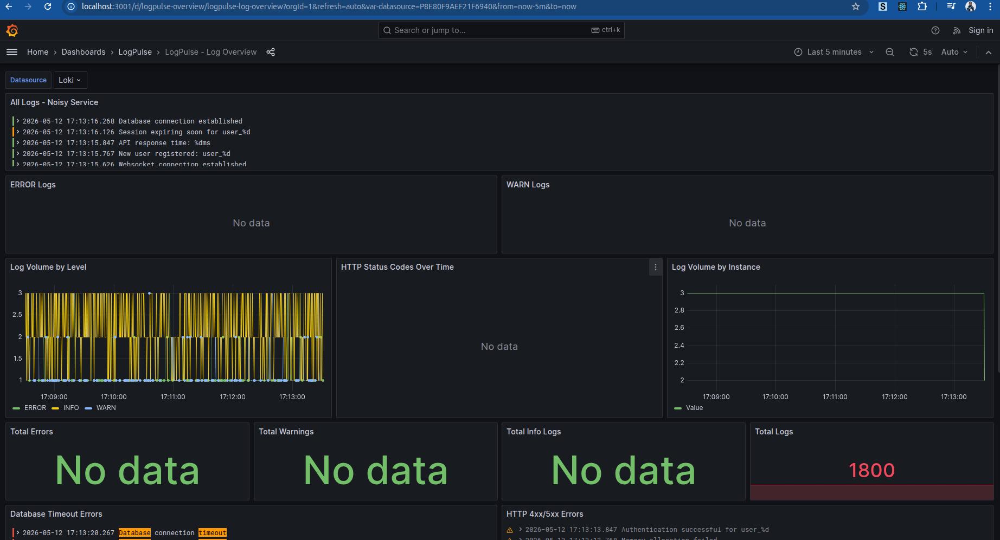

# LogPulse

A cloud-native log aggregation stack using Go, Grafana, Loki, and Promtail. Centralize, persist, and query Kubernetes logs with LogQL.

## Overview

LogPulse is a complete observability stack designed to demonstrate the log lifecycle in a Kubernetes environment. It simulates a real-world microservice that generates structured logs, collects them using Promtail, stores them in Loki, and visualizes them in Grafana.

### Architecture

```
+-----------------+     +-------------+     +----------+     +-------------+
|  Noisy Service  |---->|  Promtail   |---->|   Loki   |---->|   Grafana   |
|  (Log Generator)|     | (Collector) |     | (Storage)|     |(Visualization)
+-----------------+     +-------------+     +----------+     +-------------+
       Go App              DaemonSet          StatefulSet        Deployment
```

## Container Images

| Component | Image | Description |
|-----------|-------|-------------|
| Noisy Service | `adorsys/noisy-service:latest` | Go log generator application |
| Promtail | `grafana/promtail:2.9.0` | Log collector agent |
| Loki | `grafana/loki:2.9.0` | Log aggregation system |
| Grafana | `grafana/grafana:10.2.0` | Visualization platform |

## Quick Start

### Prerequisites

- Kubernetes cluster (minikube, kind, or cloud provider)
- kubectl configured to connect to your cluster
- Docker installed

### Deploy the Stack

```bash
# Make scripts executable
chmod +x scripts/deploy.sh scripts/cleanup.sh

# Deploy everything
./scripts/deploy.sh
```

### Access Grafana

```bash
# Option 1: NodePort (default)
# Access at: http://<node-ip>:30030

# Option 2: Port-forward
kubectl port-forward -n logpulse svc/grafana 3000:3000
# Access at: http://localhost:3000
```

**Default Credentials:**
- Username: `admin`
- Password: `admin`

### Cleanup

```bash
./scripts/cleanup.sh
```

## Components

### Phase 1: Generation Layer (Go App)

The noisy-service is a Go application that generates structured JSON logs simulating a real microservice:

- **Log Levels**: DEBUG, INFO, WARN, ERROR
- **Structured Format**: JSON with contextual labels
- **Configurable**: Environment variables for noise level, interval, etc.

**Environment Variables:**
| Variable | Default | Description |
|----------|---------|-------------|
| `APP_NAME` | noisy-service | Application name |
| `ENVIRONMENT` | development | Environment name |
| `TEAM` | platform | Team name |
| `LOG_INTERVAL_MS` | 500 | Log interval in milliseconds |
| `NOISE_LEVEL` | 0.15 | Error rate (0.0-1.0) |

### Phase 2: Collection Layer (Promtail)

Promtail runs as a DaemonSet on each node, automatically discovering and scraping logs:

- **Kubernetes Service Discovery**: Automatically finds pods
- **JSON Parsing**: Extracts structured fields from logs
- **Label Extraction**: Creates Loki labels from log fields

### Phase 3: Storage Layer (Loki)

Loki stores logs efficiently with label-based indexing:

- **Lightweight**: Only indexes labels, not full text
- **Persistent**: Uses PersistentVolumes for data retention
- **Retention**: Configurable log retention (31 days default)

### Phase 4: Visualization Layer (Grafana)

Pre-configured dashboards for log analysis:

- **Log Overview**: All logs from noisy-service
- **Error Tracking**: ERROR and WARN logs
- **Metrics**: Log volume by level, status codes, instances
- **Database Timeouts**: Filtered view of database errors

### Phase 5: Infrastructure Layer (Persistence)

- **PersistentVolumeClaim**: Ensures data survives pod restarts
- **StatefulSet**: Stable network identity for Loki

## LogQL Examples

### Basic Queries

```logql
# All logs from noisy-service
{app="noisy-service"}

# Only ERROR logs
{app="noisy-service"} |= "ERROR"

# Filter by JSON field
{app="noisy-service"} | json | level="ERROR"

# HTTP 5xx errors
{app="noisy-service"} | json | status_code >= 500
```

### Aggregation Queries

```logql
# Log count by level over time
sum by (level) (count_over_time({app="noisy-service"}[5m]))

# Error rate
sum(rate({app="noisy-service"} |= "ERROR" [5m])) / sum(rate({app="noisy-service"}[5m]))

# Top 10 paths with most errors
topk(10, sum by (path) (count_over_time({app="noisy-service"} |= "ERROR" [1h])))
```

### Advanced Queries

```logql
# Database timeout errors across all containers
{app="noisy-service"} |= "Database" |= "timeout"

# 404 errors in the last hour
{app="noisy-service"} | json | status_code = 404

# Average response time by instance
avg by (instance) (avg_over_time({app="noisy-service"} | json | unwrap duration_ms [5m]))
```

## Dashboards

The LogPulse dashboard includes:

1. **All Logs Panel**: Real-time log stream
2. **Error Logs Panel**: Filtered ERROR level logs
3. **Warning Logs Panel**: Filtered WARN level logs
4. **Log Volume by Level**: Time series chart
5. **HTTP Status Codes**: Distribution over time
6. **Log Volume by Instance**: Per-instance breakdown
7. **Statistics**: Total errors, warnings, info logs
8. **Database Timeouts**: Specific error tracking
9. **HTTP Methods Distribution**: GET, POST, PUT, DELETE, PATCH
10. **Response Time Analysis**: Average response times

### Screenshot



*LogPulse dashboard showing real-time log visualization in Grafana*

## Configuration

### Customize Log Generation

Edit `k8s/app/deployment.yaml`:

```yaml
env:
  - name: NOISE_LEVEL
    value: "0.20"  # Increase error rate to 20%
  - name: LOG_INTERVAL_MS
    value: "200"   # Faster log generation
```

### Adjust Loki Retention

Edit `k8s/loki/configmap.yaml`:

```yaml
limits_config:
  retention_period: 168h  # 7 days
```

### Scale the Noisy Service

```bash
kubectl scale deployment noisy-service -n logpulse --replicas=5
```

## Troubleshooting

### Check Pod Status

```bash
kubectl get pods -n logpulse
```

### View Logs

```bash
# Noisy service logs
kubectl logs -f -n logpulse -l app=noisy-service

# Promtail logs
kubectl logs -f -n logpulse -l app.kubernetes.io/name=promtail

# Loki logs
kubectl logs -f -n logpulse -l app.kubernetes.io/name=loki

# Grafana logs
kubectl logs -f -n logpulse -l app.kubernetes.io/name=grafana
```

### Common Issues

1. **Loki not starting**: Check PVC is bound
   ```bash
   kubectl get pvc -n logpulse
   ```

2. **No logs in Grafana**: Verify Promtail is running
   ```bash
   kubectl get daemonset -n logpulse
   ```

3. **High memory usage**: Reduce retention or scale Loki

## Learning Objectives

This project demonstrates:

1. **Structured Logging**: How to generate parseable JSON logs
2. **Log Collection**: Kubernetes-native log discovery
3. **Log Storage**: Efficient label-based indexing
4. **Log Visualization**: Creating meaningful dashboards
5. **Persistence**: Stateful workloads in Kubernetes
6. **Observability**: End-to-end log pipeline

## Contributing

Contributions are welcome! Please feel free to submit a Pull Request.

## License

This project is licensed under the MIT License - see the [LICENSE](LICENSE) file for details.

## Acknowledgments

- [Grafana Loki](https://grafana.com/oss/loki/) - Log aggregation system
- [Promtail](https://grafana.com/docs/loki/latest/clients/promtail/) - Log collector
- [Grafana](https://grafana.com/oss/grafana/) - Visualization platform
- [Kubernetes](https://kubernetes.io/) - Container orchestration
