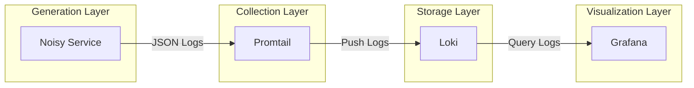

# LogPulse Documentation

## Overview

LogPulse is a cloud-native log aggregation stack that demonstrates the complete log lifecycle: generation, collection, storage, and visualization. It is designed to run on Kubernetes and follows best practices for observability in microservices environments.

## Documentation Index

| Document | Description |
|----------|-------------|
| [Architecture](architecture.md) | System architecture, data flow, and component overview |
| [Noisy Service](noisy-service.md) | Log generation layer - Go application details |
| [Promtail](promtail.md) | Collection layer - Log discovery and forwarding |
| [Loki](loki.md) | Storage layer - Log aggregation and querying |
| [Grafana](grafana.md) | Visualization layer - Dashboards and exploration |

## Quick Start

### Prerequisites

- Kubernetes cluster (minikube, kind, or cloud provider)
- kubectl configured
- Docker installed

### Deploy

```bash
# Clone the repository
git clone <repository-url>
cd logpulse

# Deploy the stack
./scripts/deploy.sh
```

### Access

```bash
# Port forward to Grafana
kubectl port-forward -n logpulse svc/grafana 3000:3000

# Open in browser
http://localhost:3000
```

**Default Credentials:**
- Username: admin
- Password: admin

## Architecture Overview



## Components

### Generation Layer

The noisy-service generates structured JSON logs simulating a real microservice:

- Multiple log levels (INFO, WARN, ERROR)
- Configurable error rate
- Distributed tracing IDs
- HTTP request simulation

[View Noisy Service Documentation](noisy-service.md)

### Collection Layer

Promtail runs as a DaemonSet on each node, discovering pods and collecting their logs:

- Kubernetes service discovery
- JSON log parsing
- Label extraction
- Position tracking

[View Promtail Documentation](promtail.md)

### Storage Layer

Loki stores logs efficiently with label-based indexing:

- Low storage overhead
- LogQL query language
- Retention management
- Multi-tenancy support

[View Loki Documentation](loki.md)

### Visualization Layer

Grafana provides dashboards and log exploration:

- Pre-configured dashboards
- LogQL query builder
- Real-time log streaming
- Alerting capabilities

[View Grafana Documentation](grafana.md)

## Project Structure

```
logpulse/
├── app/                    # Go application (log generator)
│   ├── main.go
│   ├── go.mod
│   └── Dockerfile
├── k8s/                    # Kubernetes manifests
│   ├── namespace.yaml
│   ├── app/               # Noisy service
│   ├── promtail/          # Log collector
│   ├── loki/              # Log storage
│   └── grafana/           # Visualization
├── scripts/               # Automation scripts
│   ├── deploy.sh
│   └── cleanup.sh
├── docs/                  # Documentation
│   ├── README.md
│   ├── architecture.md
│   ├── noisy-service.md
│   ├── promtail.md
│   ├── loki.md
│   └── grafana.md
├── README.md
├── Todo.md
└── .gitignore
```

## Common Operations

### View Logs

```bash
# Noisy service logs
kubectl logs -f -n logpulse -l app.kubernetes.io/name=noisy-service

# Promtail logs
kubectl logs -f -n logpulse -l app.kubernetes.io/name=promtail

# Loki logs
kubectl logs -f -n logpulse -l app.kubernetes.io/name=loki

# Grafana logs
kubectl logs -f -n logpulse -l app.kubernetes.io/name=grafana
```

### Scale Deployment

```bash
# Scale noisy service
kubectl scale deployment noisy-service -n logpulse --replicas=5
```

### Check Status

```bash
# All pods
kubectl get pods -n logpulse

# All services
kubectl get services -n logpulse

# Persistent volumes
kubectl get pvc -n logpulse
```

### Cleanup

```bash
# Remove all components
./scripts/cleanup.sh
```

## Troubleshooting

### Pods Not Starting

1. Check pod status:
```bash
kubectl describe pod -n logpulse <pod-name>
```

2. Check events:
```bash
kubectl get events -n logpulse --sort-by='.lastTimestamp'
```

3. Check logs:
```bash
kubectl logs -n logpulse <pod-name>
```

### No Logs in Grafana

1. Verify Promtail is running:
```bash
kubectl get pods -n logpulse -l app.kubernetes.io/name=promtail
```

2. Check Loki is receiving:
```bash
kubectl logs -n logpulse -l app.kubernetes.io/name=loki
```

3. Test Loki query:
```bash
kubectl port-forward -n logpulse svc/loki 3100:3100
curl -G 'http://localhost:3100/loki/api/v1/query' \
  --data-urlencode 'query={app="noisy-service"}'
```

### High Resource Usage

1. Check resource consumption:
```bash
kubectl top pods -n logpulse
```

2. Adjust limits in manifests
3. Scale horizontally if needed

## Contributing

1. Fork the repository
2. Create a feature branch
3. Make your changes
4. Submit a pull request

## License

See [LICENSE](../LICENSE) file for details.