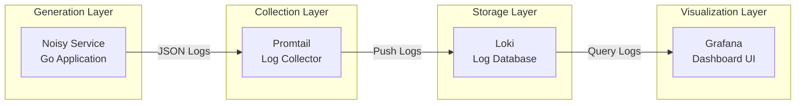
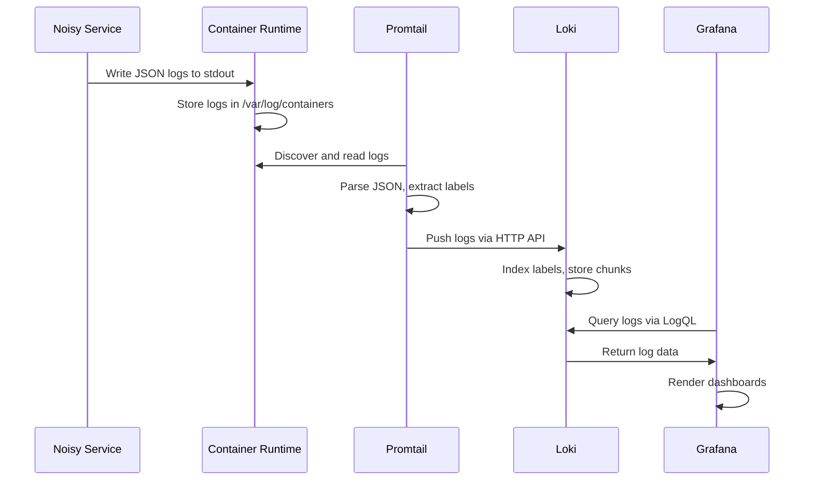
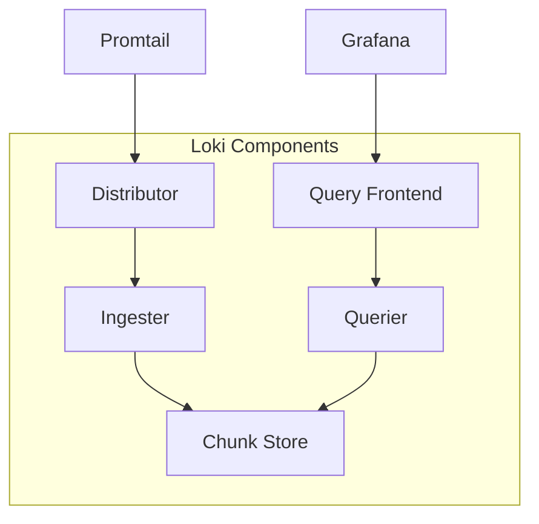

# LogPulse Architecture

## Overview

LogPulse is a cloud-native log aggregation stack that implements a complete log lifecycle: generation, collection, storage, and visualization. The system is designed to run on Kubernetes and demonstrates best practices for observability in microservices environments.

## System Architecture



## Data Flow



## Components

### Phase 1: Generation Layer

#### Noisy Service

The noisy-service is a Go application that simulates a real microservice by generating structured JSON logs at configurable intervals.

**Purpose:**
- Generate realistic log patterns for testing the observability stack
- Demonstrate structured logging best practices
- Provide configurable log volume and error rates

**Key Features:**
- Structured JSON log output
- Multiple log levels (INFO, WARN, ERROR)
- Configurable noise level (error rate)
- Trace ID and Span ID generation for distributed tracing
- HTTP method and path simulation
- Response time simulation

**Configuration:**
| Environment Variable | Default | Description |
|---------------------|---------|-------------|
| APP_NAME | noisy-service | Application identifier |
| ENVIRONMENT | development | Environment name |
| TEAM | platform | Team name |
| LOG_INTERVAL_MS | 500 | Milliseconds between log entries |
| NOISE_LEVEL | 0.15 | Error rate (0.0-1.0) |

**Log Output Example:**
```json
{
  "timestamp": "2024-01-15T10:30:00.123456789Z",
  "level": "ERROR",
  "message": "Database connection timeout",
  "app": "noisy-service",
  "environment": "development",
  "team": "platform",
  "instance": "noisy-service-abc123",
  "trace_id": "a1b2c3d4e5f6...",
  "span_id": "1234567890abcdef",
  "duration_ms": 450,
  "status_code": 500,
  "method": "POST",
  "path": "/api/users",
  "user_id": "user_1234",
  "error": "operation failed"
}
```

---

### Phase 2: Collection Layer

#### Promtail

Promtail is the log collection agent that runs as a DaemonSet on each Kubernetes node. It discovers pods, reads their logs, and forwards them to Loki.

**Purpose:**
- Discover running pods via Kubernetes API
- Read container logs from the node's filesystem
- Parse and enrich logs with metadata
- Push logs to Loki for storage

**Key Features:**
- Kubernetes service discovery
- JSON log parsing
- Label extraction from log content
- Position tracking (resumes from last read position)
- Multi-tenant support

**Configuration Highlights:**
```yaml
scrape_configs:
  - job_name: kubernetes-pods
    kubernetes_sd_configs:
      - role: pod
    pipeline_stages:
      - json:
          expressions:
            timestamp: timestamp
            level: level
            message: message
      - labels:
          level:
          app:
      - timestamp:
          source: timestamp
          format: RFC3339Nano
```

**How It Works:**
1. Promtail runs on every node (DaemonSet)
2. It watches the Kubernetes API for new pods
3. Discovers log file locations for each container
4. Reads logs in real-time, tracking position
5. Parses JSON logs and extracts labels
6. Pushes logs to Loki via HTTP API

---

### Phase 3: Storage Layer

#### Loki

Loki is a log aggregation system designed to be cost-effective and easy to operate. Unlike Elasticsearch, it doesn't index the full log content, only labels.

**Purpose:**
- Store log data efficiently
- Index only labels for fast queries
- Provide LogQL query interface
- Manage log retention and compaction

**Key Features:**
- Label-based indexing (low storage overhead)
- LogQL query language
- Multi-tenancy support
- Retention policies
- Compaction for storage efficiency

**Architecture:**


**Configuration Highlights:**
```yaml
schema_config:
  configs:
    - from: 2020-10-24
      store: boltdb-shipper
      object_store: filesystem
      schema: v11
      index:
        prefix: index_
        period: 24h

limits_config:
  retention_period: 744h  # 31 days
  ingestion_rate_mb: 10
```

**Storage Strategy:**
- Logs are stored in chunks (compressed blocks)
- Only labels are indexed
- Full text search via LogQL at query time
- Efficient for high-volume logging

---

### Phase 4: Visualization Layer

#### Grafana

Grafana provides the user interface for querying and visualizing logs stored in Loki.

**Purpose:**
- Visualize log data through dashboards
- Query logs using LogQL
- Create alerts based on log patterns
- Explore logs in real-time

**Key Features:**
- Pre-configured Loki datasource
- Custom dashboards for log visualization
- Log exploration interface
- Alerting capabilities

**Dashboard Panels:**
1. All Logs - Real-time log stream
2. Error Logs - Filtered ERROR level logs
3. Warning Logs - Filtered WARN level logs
4. Log Volume by Level - Time series chart
5. HTTP Status Codes - Distribution over time
6. Log Volume by Instance - Per-instance breakdown
7. Statistics - Total errors, warnings, info logs
8. Database Timeouts - Specific error tracking
9. HTTP Methods Distribution - GET, POST, PUT, DELETE, PATCH
10. Response Time Analysis - Average response times

---

### Phase 5: Infrastructure Layer

#### Persistent Storage

Loki uses PersistentVolumeClaims to ensure data survives pod restarts.

**Purpose:**
- Persist log data across pod restarts
- Enable data recovery
- Support log retention policies

**Configuration:**
```yaml
apiVersion: v1
kind: PersistentVolumeClaim
metadata:
  name: loki-storage
spec:
  accessModes:
    - ReadWriteOnce
  resources:
    requests:
      storage: 10Gi
  storageClassName: standard
```

---

## LogQL Query Examples

### Basic Queries

```logql
# All logs from noisy-service
{app="noisy-service"}

# Only ERROR logs
{app="noisy-service"} |= "ERROR"

# Filter by JSON field
{app="noisy-service"} | json | level="ERROR"

# HTTP 5xx errors
{app="noisy-service"} | json | status_code >= 500
```

### Aggregation Queries

```logql
# Log count by level over time
sum by (level) (count_over_time({app="noisy-service"}[5m]))

# Error rate
sum(rate({app="noisy-service"} |= "ERROR" [5m])) 
  / sum(rate({app="noisy-service"}[5m]))

# Top 10 paths with most errors
topk(10, sum by (path) (count_over_time({app="noisy-service"} |= "ERROR" [1h])))
```

### Advanced Queries

```logql
# Database timeout errors
{app="noisy-service"} |= "Database" |= "timeout"

# 404 errors in the last hour
{app="noisy-service"} | json | status_code = 404

# Average response time by instance
avg by (instance) (avg_over_time({app="noisy-service"} 
  | json | unwrap duration_ms [5m]))
```

---

## Deployment

### Prerequisites

- Kubernetes cluster (minikube, kind, or cloud provider)
- kubectl configured
- Docker installed

### Quick Start

```bash
# Deploy the entire stack
./scripts/deploy.sh

# Check pod status
kubectl get pods -n logpulse

# Access Grafana
kubectl port-forward -n logpulse svc/grafana 3000:3000
```

### Cleanup

```bash
# Remove all components
./scripts/cleanup.sh
```

---

## Best Practices

### Structured Logging

1. Always use structured JSON format
2. Include consistent labels (app, environment, team)
3. Add trace IDs for distributed tracing
4. Include relevant context (user_id, method, path)

### Label Strategy

1. Keep labels low cardinality
2. Use consistent label names across services
3. Avoid dynamic labels (can cause high cardinality)
4. Index only what you query

### Resource Management

1. Set appropriate resource limits
2. Configure log retention policies
3. Monitor storage usage
4. Use compression for log chunks

---

## Troubleshooting

### Common Issues

**No logs in Grafana:**
1. Check Promtail is running: `kubectl get pods -n logpulse -l app.kubernetes.io/name=promtail`
2. Verify Loki is receiving data: `kubectl logs -n logpulse -l app.kubernetes.io/name=loki`
3. Check datasource configuration in Grafana

**High memory usage:**
1. Reduce retention period
2. Lower ingestion rate limits
3. Scale Loki horizontally

**Pod not starting:**
1. Check image availability: `minikube image ls | grep noisy-service`
2. Verify resource limits
3. Check node resources