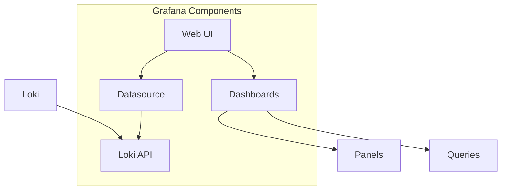
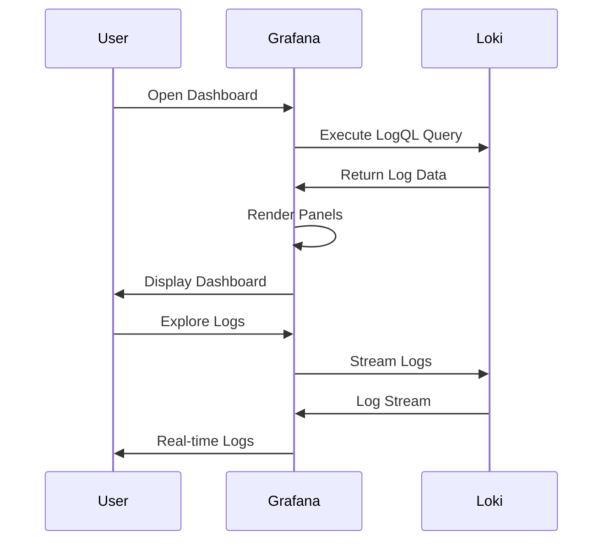

# Grafana

## Overview

Grafana is the visualization layer in the LogPulse stack. It provides a web interface for querying logs stored in Loki using LogQL and creating dashboards for log analysis.

## Purpose

- Visualize log data through dashboards
- Query logs using LogQL
- Create alerts based on log patterns
- Explore logs in real-time
- Share insights with team members

## Architecture



## How It Works



## Configuration

### Deployment Configuration

```yaml
apiVersion: apps/v1
kind: Deployment
metadata:
  name: grafana
  namespace: logpulse
spec:
  replicas: 1
  selector:
    matchLabels:
      app.kubernetes.io/name: grafana
  template:
    spec:
      containers:
        - name: grafana
          image: grafana/grafana:10.2.3-ubuntu
          ports:
            - name: http
              containerPort: 3000
          env:
            - name: GF_SECURITY_ADMIN_USER
              value: "admin"
            - name: GF_SECURITY_ADMIN_PASSWORD
              value: "admin"
```

### Service Configuration

```yaml
apiVersion: v1
kind: Service
metadata:
  name: grafana
  namespace: logpulse
spec:
  type: NodePort
  selector:
    app.kubernetes.io/name: grafana
  ports:
    - name: http
      port: 3000
      targetPort: http
      nodePort: 30030
```

### Datasource Configuration

```yaml
apiVersion: v1
kind: ConfigMap
metadata:
  name: grafana-datasources
  namespace: logpulse
data:
  datasources.yaml: |
    apiVersion: 1
    datasources:
      - name: Loki
        type: loki
        access: proxy
        url: http://loki:3100
        isDefault: true
        editable: true
```

## Dashboard Configuration

### Dashboard Provider

```yaml
apiVersion: v1
kind: ConfigMap
metadata:
  name: grafana-dashboards
  namespace: logpulse
data:
  dashboards.yaml: |
    apiVersion: 1
    providers:
      - name: 'logpulse'
        orgId: 1
        folder: 'LogPulse'
        type: file
        options:
          path: /etc/grafana/provisioning/dashboards
```

### Pre-configured Dashboard

The LogPulse dashboard includes:

| Panel | Description |
|-------|-------------|
| All Logs | Real-time log stream from noisy-service |
| Error Logs | Filtered ERROR level logs |
| Warning Logs | Filtered WARN level logs |
| Log Volume by Level | Time series of log counts by level |
| HTTP Status Codes | Distribution of status codes over time |
| Log Volume by Instance | Per-instance log volume |
| Total Errors | Count of ERROR logs |
| Total Warnings | Count of WARN logs |
| Total Info Logs | Count of INFO logs |
| Total Logs | Count of all logs |
| Database Timeouts | Filtered database timeout errors |
| HTTP 4xx/5xx Errors | HTTP error logs |
| HTTP Methods Distribution | Request methods over time |
| Response Time Analysis | Average response times |

## Access

### NodePort Access

```bash
# Access via NodePort
http://<node-ip>:30030
```

### Port Forward Access

```bash
# Port forward to local machine
kubectl port-forward -n logpulse svc/grafana 3000:3000

# Access in browser
http://localhost:3000
```

### Default Credentials

| Field | Value |
|-------|-------|
| Username | admin |
| Password | admin |

## LogQL Queries in Dashboards

### Log Stream Panel

```logql
{app="noisy-service"} |= ``
```

### Error Logs Panel

```logql
{app="noisy-service"} |= "ERROR"
```

### Log Volume by Level

```logql
sum by (level) (count_over_time({app="noisy-service"} [$__interval]))
```

### HTTP Status Codes

```logql
sum by (status_code) (count_over_time({app="noisy-service"} 
  | json | __error__="" [$__interval]))
```

### Total Errors

```logql
sum(count_over_time({app="noisy-service"} |= "ERROR" [$__range]))
```

### Database Timeouts

```logql
{app="noisy-service"} |= "Database" |= "timeout"
```

## Log Exploration

### Using Explore View

1. Navigate to Explore in Grafana
2. Select Loki datasource
3. Enter LogQL query
4. View results in real-time

### Query Builder

Grafana provides a query builder for LogQL:

1. Select label (e.g., app)
2. Select operator (=, !=, =~, !~)
3. Select value
4. Add filters as needed

### Live Tail

For real-time log viewing:

1. Open Explore
2. Enter query
3. Click "Live" button
4. Watch logs stream in real-time

## Alerting

### Creating Alerts

```yaml
# Example alert rule
alert: HighErrorRate
expr: |
  sum(rate({app="noisy-service"} |= "ERROR" [5m])) 
    / sum(rate({app="noisy-service"}[5m])) > 0.1
for: 5m
labels:
  severity: warning
annotations:
  summary: High error rate detected
  description: Error rate is above 10%
```

### Alert Rules

1. Navigate to Alerting > Alert rules
2. Create new rule
3. Define query
4. Set condition
5. Configure notifications

## Resource Requirements

```yaml
resources:
  requests:
    cpu: 100m
    memory: 128Mi
  limits:
    cpu: 500m
    memory: 256Mi
```

## Monitoring

### Health Check

```bash
# Check Grafana is running
kubectl get pods -n logpulse -l app.kubernetes.io/name=grafana

# Check Grafana health
kubectl exec -n logpulse deployment/grafana -- curl http://localhost:3000/api/health
```

### Key Metrics

| Metric | Description |
|--------|-------------|
| grafana_request_duration_seconds | Request latency |
| grafana_active_sessions | Active user sessions |
| grafana_data_source_request_total | Datasource requests |

## Troubleshooting

### Cannot Access Grafana

1. Check pod status:
```bash
kubectl get pods -n logpulse -l app.kubernetes.io/name=grafana
```

2. Check service:
```bash
kubectl get svc -n logpulse grafana
```

3. Check logs:
```bash
kubectl logs -n logpulse -l app.kubernetes.io/name=grafana
```

### No Data in Dashboards

1. Verify Loki datasource:
```bash
kubectl get configmap -n logpulse grafana-datasources -o yaml
```

2. Test Loki connection:
```bash
kubectl exec -n logpulse deployment/grafana -- curl http://loki:3100/ready
```

3. Check Promtail:
```bash
kubectl logs -n logpulse -l app.kubernetes.io/name=promtail
```

### Dashboard Not Loading

1. Check dashboard configmap:
```bash
kubectl get configmap -n logpulse grafana-dashboards -o yaml
```

2. Verify dashboard JSON:
```bash
kubectl get configmap -n logpulse grafana-dashboards -o jsonpath='{.data.logpulse-overview\.json}' | jq .
```

## Best Practices

1. Use variables for flexible dashboards
2. Set appropriate refresh intervals
3. Use annotations for events
4. Organize dashboards by folder
5. Use dashboard links for navigation
6. Configure proper permissions
7. Use alerting for critical metrics
8. Export dashboards as code
9. Use query variables for reusable queries
10. Optimize queries for performance

## Dashboard Variables

### Example Variables

```yaml
# Datasource variable
datasource:
  type: datasource
  query: loki

# App variable
app:
  type: query
  query: label_values(app)
  
# Level variable
level:
  type: custom
  options: ["INFO", "WARN", "ERROR"]
```

### Using Variables in Queries

```logql
{app="$app"} | json | level="$level"
```

## Annotations

Annotations allow marking events on dashboards:

```yaml
# Query for annotations
{app="noisy-service"} |= "ERROR"
```

Annotations can show:
- Deployment events
- Incident markers
- Custom events