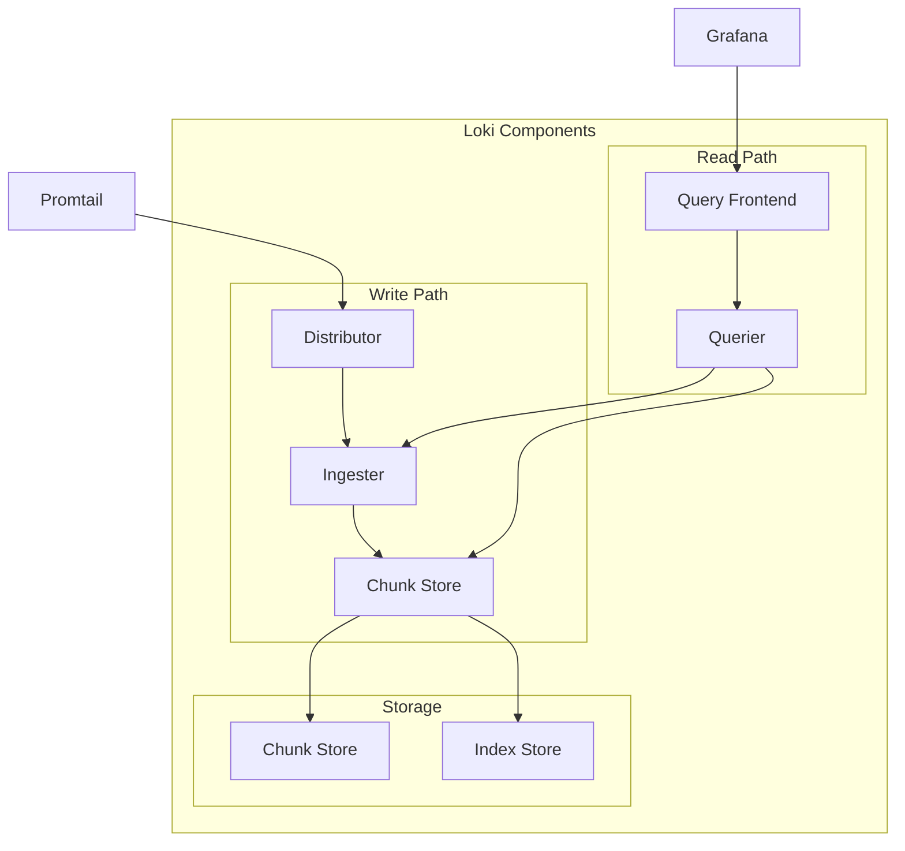
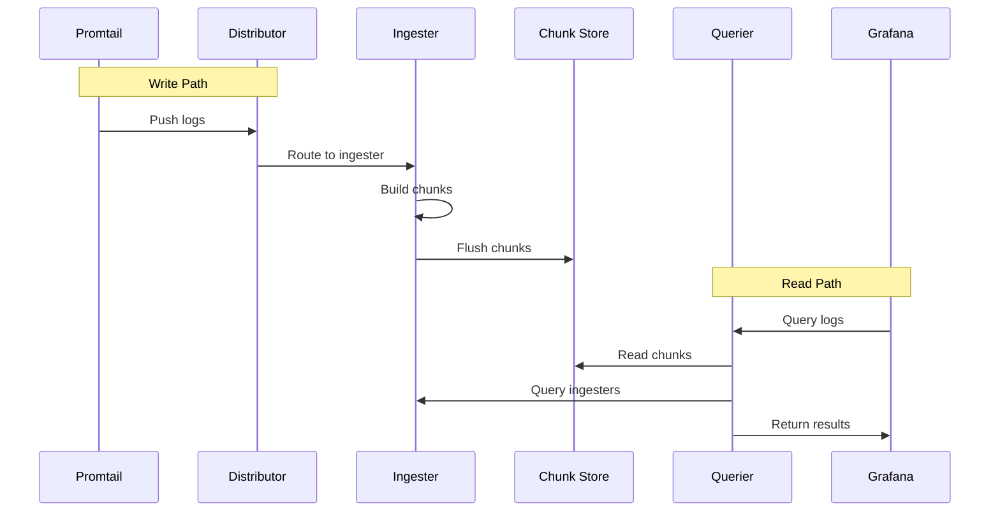
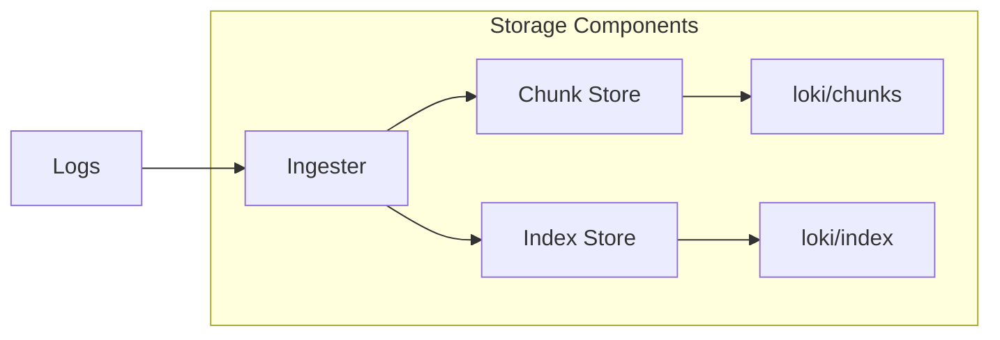
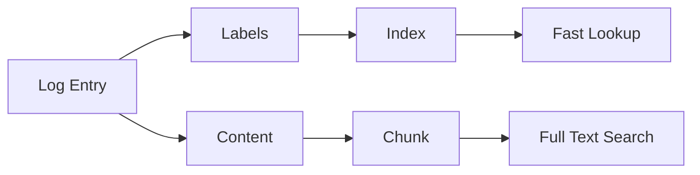

# Loki

## Overview

Loki is the log aggregation system in the LogPulse stack. It is designed to be cost-effective and easy to operate, storing logs efficiently by only indexing labels rather than the full log content.

## Purpose

- Store log data efficiently
- Index only labels for fast queries
- Provide LogQL query interface
- Manage log retention and compaction
- Support multi-tenancy

## Architecture



## How It Works



## Configuration

### StatefulSet Configuration

Loki runs as a StatefulSet for persistent storage:

```yaml
apiVersion: apps/v1
kind: StatefulSet
metadata:
  name: loki
  namespace: logpulse
spec:
  serviceName: loki
  replicas: 1
  template:
    spec:
      containers:
        - name: loki
          image: grafana/loki:2.9.3
          args:
            - -config.file=/etc/loki/loki.yaml
          ports:
            - name: http
              containerPort: 3100
            - name: grpc
              containerPort: 9096
          volumeMounts:
            - name: config
              mountPath: /etc/loki
            - name: storage
              mountPath: /loki
```

### Loki Configuration

```yaml
auth_enabled: false

server:
  http_listen_port: 3100
  grpc_listen_port: 9096

common:
  path_prefix: /loki
  storage:
    filesystem:
      chunks_directory: /loki/chunks
      rules_directory: /loki/rules
  replication_factor: 1
  ring:
    kvstore:
      store: inmemory

schema_config:
  configs:
    - from: 2020-10-24
      store: boltdb-shipper
      object_store: filesystem
      schema: v11
      index:
        prefix: index_
        period: 24h

limits_config:
  retention_period: 744h  # 31 days
  ingestion_rate_mb: 10
  ingestion_burst_size_mb: 20
```

## Storage Architecture



### Storage Components

| Component | Purpose |
|-----------|---------|
| Chunk Store | Stores compressed log data |
| Index Store | Stores label indexes |
| Compactor | Manages retention and compaction |

## Indexing Strategy

Loki uses a unique indexing strategy:



### Label-Based Indexing

Only labels are indexed:
- Fast label-based queries
- Low storage overhead
- Full text search at query time

### Example Labels

```json
{
  "app": "noisy-service",
  "environment": "development",
  "level": "ERROR",
  "team": "platform"
}
```

## LogQL

LogQL is Loki's query language, inspired by PromQL.

### Basic Queries

```logql
# Select all logs from app
{app="noisy-service"}

# Filter by string
{app="noisy-service"} |= "ERROR"

# Filter by regex
{app="noisy-service"} |~ "error|Error"

# Negate filter
{app="noisy-service"} != "DEBUG"
```

### JSON Parsing

```logql
# Parse JSON and filter
{app="noisy-service"} | json | level="ERROR"

# Extract fields
{app="noisy-service"} | json 
  | status_code >= 500

# Multiple conditions
{app="noisy-service"} | json 
  | level="ERROR" 
  | status_code >= 500
```

### Aggregations

```logql
# Count logs over time
count_over_time({app="noisy-service"}[5m])

# Rate of logs
rate({app="noisy-service"}[5m])

# Sum by label
sum by (level) (count_over_time({app="noisy-service"}[5m]))

# Average
avg_over_time({app="noisy-service"} | json | unwrap duration_ms [5m])

# Histogram
histogram_quantile(0.95, 
  sum(rate(duration_ms_bucket[5m])) by (le)
)
```

### Advanced Queries

```logql
# Top 10 error paths
topk(10, sum by (path) (
  count_over_time({app="noisy-service"} |= "ERROR" [1h])
))

# Error rate
sum(rate({app="noisy-service"} |= "ERROR" [5m])) 
  / sum(rate({app="noisy-service"}[5m]))

# Response time percentiles
histogram_quantile(0.99, 
  sum(rate(duration_ms_bucket{app="noisy-service"}[5m])) by (le)
)
```

## Retention

### Configuration

```yaml
limits_config:
  retention_period: 744h  # 31 days

compactor:
  working_directory: /loki/compactor
  shared_store: filesystem
  retention_enabled: true
  retention_delete_delay: 2h
```

### How Retention Works

1. Logs are written to chunks
2. Chunks are flushed after timeout
3. Compactor runs periodically
4. Old chunks are deleted based on retention

## Persistence

### PersistentVolumeClaim

```yaml
apiVersion: v1
kind: PersistentVolumeClaim
metadata:
  name: loki-storage
spec:
  accessModes:
    - ReadWriteOnce
  resources:
    requests:
      storage: 10Gi
  storageClassName: standard
```

### Volume Mounts

| Path | Purpose |
|------|---------|
| /loki | Loki data directory |
| /loki/chunks | Log chunks |
| /loki/index | Label indexes |
| /loki/compactor | Compactor working directory |

## Resource Requirements

```yaml
resources:
  requests:
    cpu: 100m
    memory: 256Mi
  limits:
    cpu: 500m
    memory: 512Mi
```

## Monitoring

### Health Check

```bash
# Check Loki is ready
kubectl exec -n logpulse loki-0 -- curl http://localhost:3100/ready

# Check Loki metrics
kubectl port-forward -n logpulse svc/loki 3100:3100
curl http://localhost:3100/metrics
```

### Key Metrics

| Metric | Description |
|--------|-------------|
| loki_ingester_chunks_flushed | Chunks flushed to storage |
| loki_query_request_duration_seconds | Query latency |
| loki_ingester_bytes_received | Bytes received |
| loki_compactor_running | Compactor status |

## Troubleshooting

### Loki Not Starting

1. Check PVC is bound:
```bash
kubectl get pvc -n logpulse
```

2. Check resource limits:
```bash
kubectl describe pod -n logpulse loki-0
```

3. Check logs:
```bash
kubectl logs -n logpulse loki-0
```

### No Logs in Grafana

1. Verify Loki is receiving data:
```bash
kubectl logs -n logpulse -l app.kubernetes.io/name=promtail | grep loki
```

2. Check datasource configuration:
```bash
kubectl get configmap -n logpulse grafana-datasources -o yaml
```

3. Test query directly:
```bash
kubectl port-forward -n logpulse svc/loki 3100:3100
curl -G 'http://localhost:3100/loki/api/v1/query' \
  --data-urlencode 'query={app="noisy-service"}'
```

### High Memory Usage

1. Reduce retention period
2. Lower ingestion rate limits
3. Increase chunk size
4. Scale horizontally

## Best Practices

1. Use labels judiciously (low cardinality)
2. Set appropriate retention periods
3. Monitor storage usage
4. Use persistent storage for production
5. Configure resource limits
6. Enable compression
7. Use query caching
8. Monitor query performance