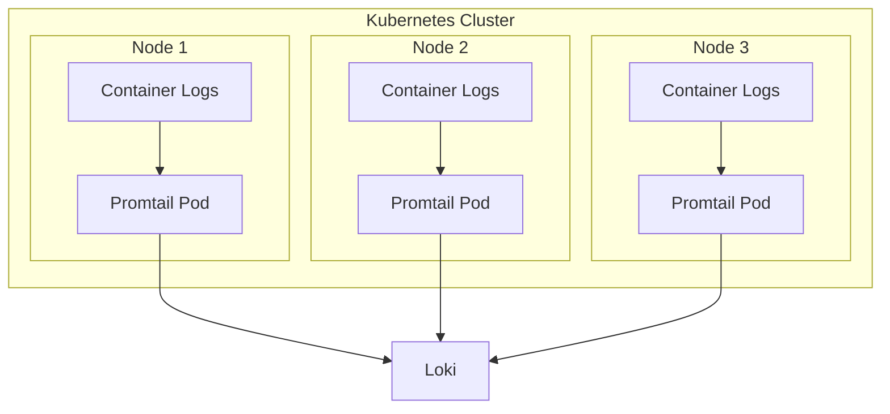
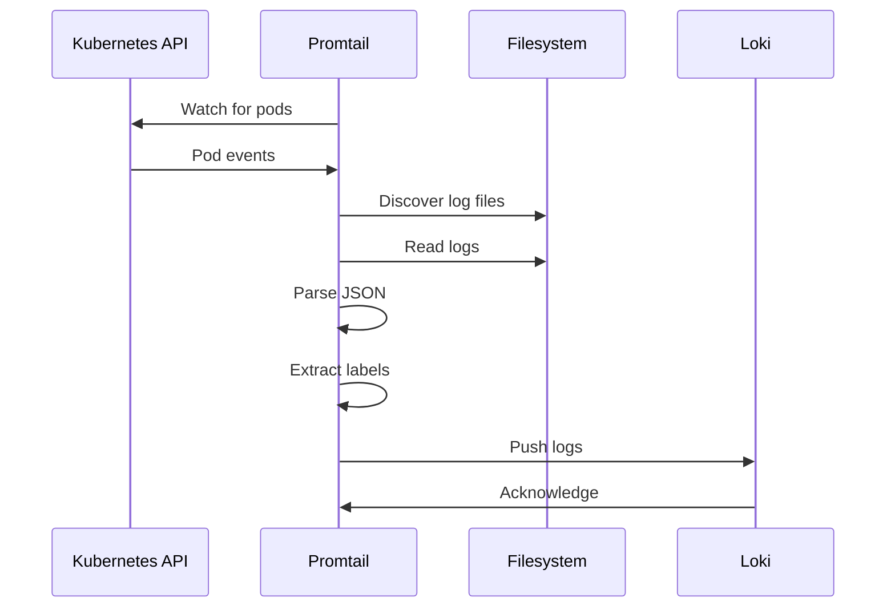

# Promtail

## Overview

Promtail is the log collection agent in the LogPulse stack. It runs as a DaemonSet on each Kubernetes node, discovers running pods, reads their logs, and forwards them to Loki for storage.

## Purpose

- Discover running pods via Kubernetes API
- Read container logs from the node's filesystem
- Parse and enrich logs with Kubernetes metadata
- Push logs to Loki for storage

## Architecture



## How It Works



## Configuration

### DaemonSet Configuration

Promtail runs as a DaemonSet, ensuring one instance per node:

```yaml
apiVersion: apps/v1
kind: DaemonSet
metadata:
  name: promtail
  namespace: logpulse
spec:
  selector:
    matchLabels:
      app.kubernetes.io/name: promtail
  template:
    spec:
      serviceAccountName: promtail
      containers:
        - name: promtail
          image: grafana/promtail:2.9.3
          args:
            - -config.file=/etc/promtail/promtail.yaml
          volumeMounts:
            - name: config
              mountPath: /etc/promtail
            - name: varlog
              mountPath: /var/log
              readOnly: true
            - name: varlibdockercontainers
              mountPath: /var/lib/docker/containers
              readOnly: true
```

### RBAC Configuration

Promtail needs permissions to discover pods:

```yaml
apiVersion: rbac.authorization.k8s.io/v1
kind: ClusterRole
metadata:
  name: promtail
rules:
  - apiGroups: [""]
    resources:
      - nodes
      - nodes/proxy
      - nodes/log
    verbs: ["get", "list", "watch"]
  - apiGroups: [""]
    resources:
      - pods
      - namespaces
    verbs: ["get", "list", "watch"]
```

### Pipeline Stages

The configuration uses pipeline stages to process logs:

```yaml
scrape_configs:
  - job_name: kubernetes-pods
    kubernetes_sd_configs:
      - role: pod
    pipeline_stages:
      # 1. Parse JSON logs
      - json:
          expressions:
            timestamp: timestamp
            level: level
            message: message
            app: app
      
      # 2. Extract labels
      - labels:
          level:
          app:
          environment:
          team:
      
      # 3. Set timestamp
      - timestamp:
          source: timestamp
          format: RFC3339Nano
      
      # 4. Output message
      - output:
          source: message
```

## Pipeline Stages Explained

### 1. JSON Stage

Parses JSON log entries and extracts fields:

```yaml
- json:
    expressions:
      timestamp: timestamp
      level: level
      message: message
      app: app
```

### 2. Labels Stage

Converts extracted fields into Loki labels:

```yaml
- labels:
    level:
    app:
    environment:
    team:
```

Labels are indexed and can be used for fast queries.

### 3. Timestamp Stage

Sets the log timestamp from the parsed field:

```yaml
- timestamp:
    source: timestamp
    format: RFC3339Nano
```

### 4. Output Stage

Sets the final log message:

```yaml
- output:
    source: message
```

## Service Discovery

Promtail uses Kubernetes service discovery to find pods:


### Discovery Configuration

```yaml
kubernetes_sd_configs:
  - role: pod
    namespaces:
      names:
        - logpulse
```

This configuration:
1. Watches the Kubernetes API for pod changes
2. Filters to the `logpulse` namespace
3. Discovers log file locations for each container
4. Starts tailing log files

## Volume Mounts

Promtail needs access to log files:

| Volume | Path | Purpose |
|--------|------|---------|
| varlog | /var/log | System logs |
| varlibdockercontainers | /var/lib/docker/containers | Container logs |
| positions | /tmp | Position tracking |

## Position Tracking

Promtail tracks the last read position for each log file:

```yaml
positions:
  filename: /tmp/positions.yaml
```

This ensures:
- Logs are not duplicated on restart
- No logs are missed during downtime
- Efficient log collection

## Resource Requirements

```yaml
resources:
  requests:
    cpu: 50m
    memory: 64Mi
  limits:
    cpu: 200m
    memory: 128Mi
```

## Monitoring

### Check Promtail Status

```bash
# View Promtail pods
kubectl get pods -n logpulse -l app.kubernetes.io/name=promtail

# View Promtail logs
kubectl logs -n logpulse -l app.kubernetes.io/name=promtail

# Check Promtail metrics
kubectl port-forward -n logpulse daemonset/promtail 9080:9080
curl http://localhost:9080/metrics
```

### Key Metrics

| Metric | Description |
|--------|-------------|
| promtail_targets_active | Number of active targets |
| promtail_read_lines_total | Total lines read |
| promtail_bytes_written_total | Bytes sent to Loki |
| promtail_request_duration_seconds | Request latency |

## Troubleshooting

### No Logs Being Collected

1. Check Promtail is running:
```bash
kubectl get pods -n logpulse -l app.kubernetes.io/name=promtail
```

2. Check RBAC permissions:
```bash
kubectl auth can-i list pods --as=system:serviceaccount:logpulse:promtail
```

3. Verify log file access:
```bash
kubectl exec -n logpulse daemonset/promtail -- ls /var/log
```

### Logs Not Reaching Loki

1. Check Loki connectivity:
```bash
kubectl exec -n logpulse daemonset/promtail -- curl http://loki:3100/ready
```

2. Check Promtail configuration:
```bash
kubectl get configmap -n logpulse promtail-config -o yaml
```

### High Memory Usage

1. Reduce pipeline complexity
2. Increase batch size
3. Add rate limiting

## Best Practices

1. Run as DaemonSet for node coverage
2. Use proper RBAC for Kubernetes API access
3. Mount log directories read-only
4. Track positions for reliability
5. Set appropriate resource limits
6. Use labels judiciously (low cardinality)
7. Monitor Promtail metrics